

# Signal Hub

### 客户运营与知识库自动回复工作台

集中管理客户会话、内容素材、跟进记录与发送任务。

**多租户管理 · 客户分组 · 内容复用 · 定时触达 · AI 辅助 · 知识库自动回复**

[界面预览](#产品界面预览) · [功能介绍](#功能介绍) · [API 对接](#api-与系统对接) · [自动回复](#租户自带知识库的自动回复) · [私有化部署](#私有化部署与合作咨询)

---

> 本仓库提供 Signal Hub 功能文档、界面示例与接口接入说明，不包含应用源码、运行配置或客户数据。Signal Hub 是独立产品，与腾讯及企业微信官方无隶属或背书关系。

Signal Hub 支持通过已配置的接入服务连接企业微信相关账号。可用能力取决于具体接入方式、服务商、账号权限及平台规则；第三方接入服务不等同于企业微信官方接口。使用前需确认账号与数据处理授权，不用于未经授权的数据采集、骚扰营销或规避平台限制。

## 产品界面预览

以下 15 个场景使用虚构演示数据，展示主要功能与操作流程。截图中的企业、账号、客户、对话和统计均为示例，不代表真实业务数据或运营效果。点击图片可查看原图。

### 01 · 指挥舱：运营情况集中查看

查看账号连接、消息与客户数量、近期触达任务，快速进入常用操作。

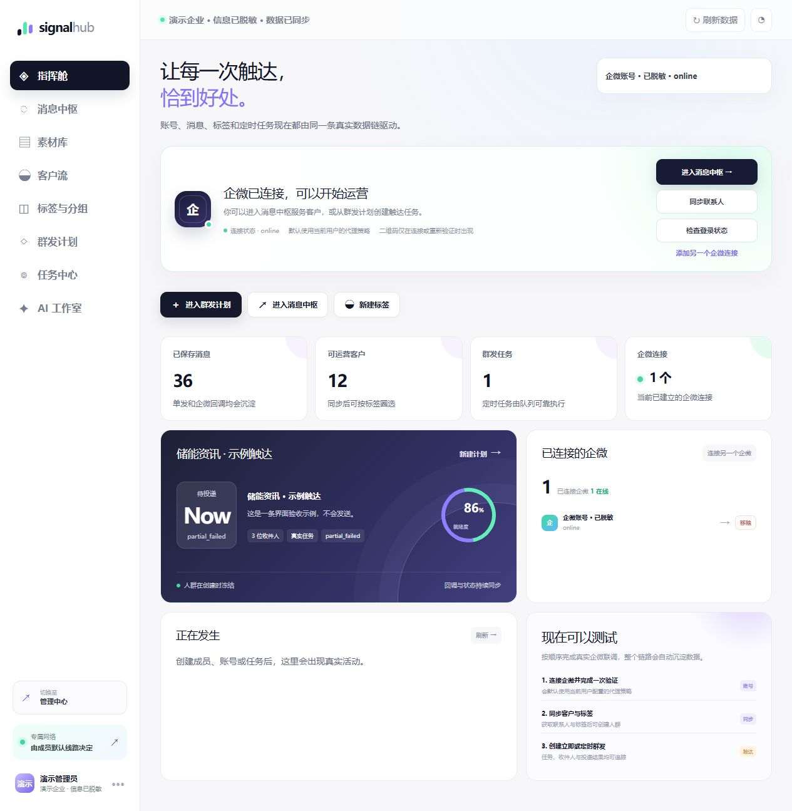

### 02 · 消息中枢：在一个工作台查看客户对话

按企微账号、联系人和标签找到会话，结合上下文继续沟通。图中为虚构咨询对话。

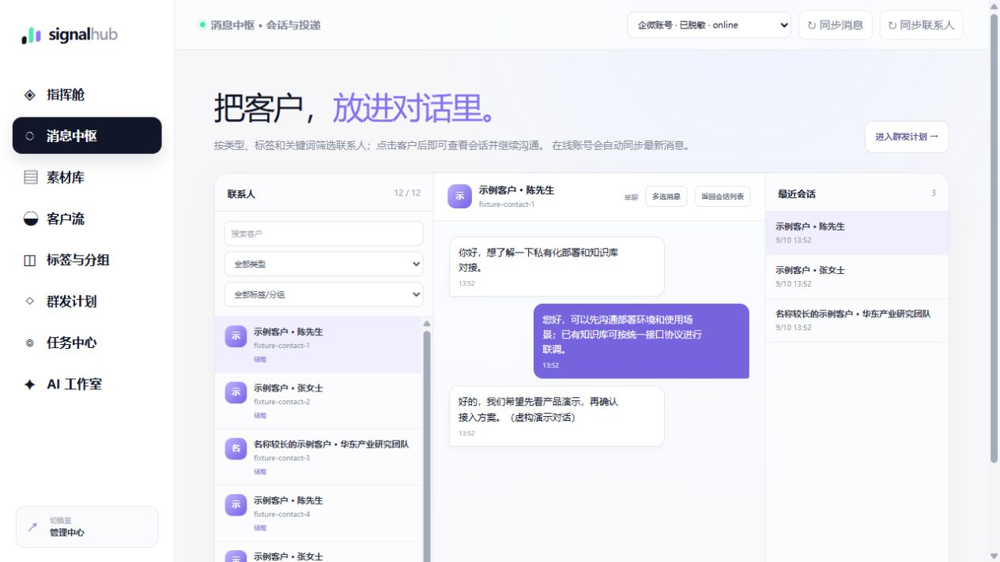

### 03 · 素材库：让常用内容可以复用

整理个人与租户共享素材包，预览内容，在消息和群发流程中复用。

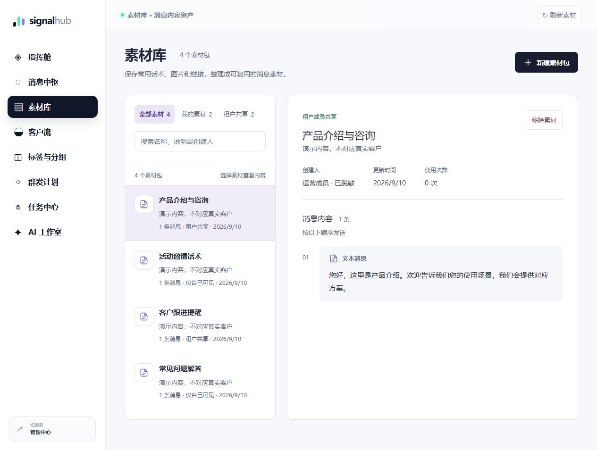

### 04 · 客户与跟进：标签、状态和下次联系

按状态筛选客户，维护标签、跟进计划和联系偏好。

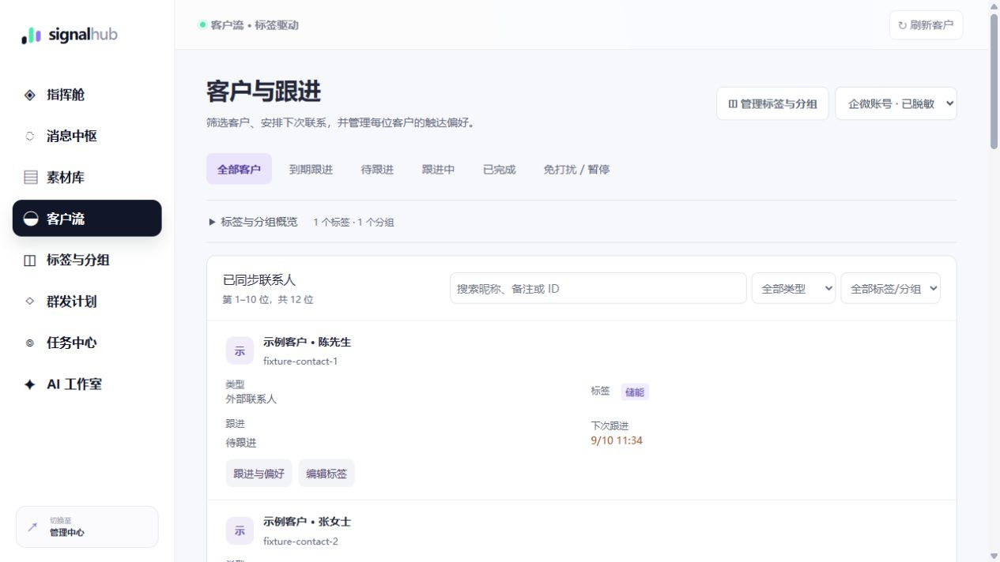

### 05 · 标签与分组：沉淀可复用的运营人群

维护标签并组合为人群，后续在群发计划中选择使用。

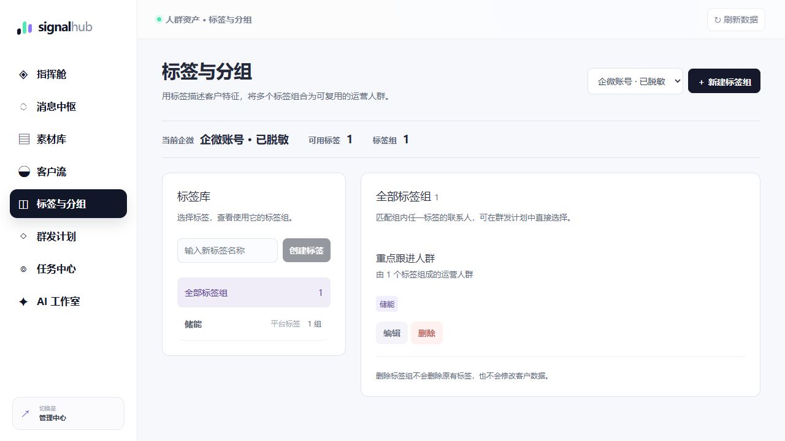

### 06 · 群发计划：选择内容与收件人

设置账号、消息内容、发送时间和人群，核对后再提交。

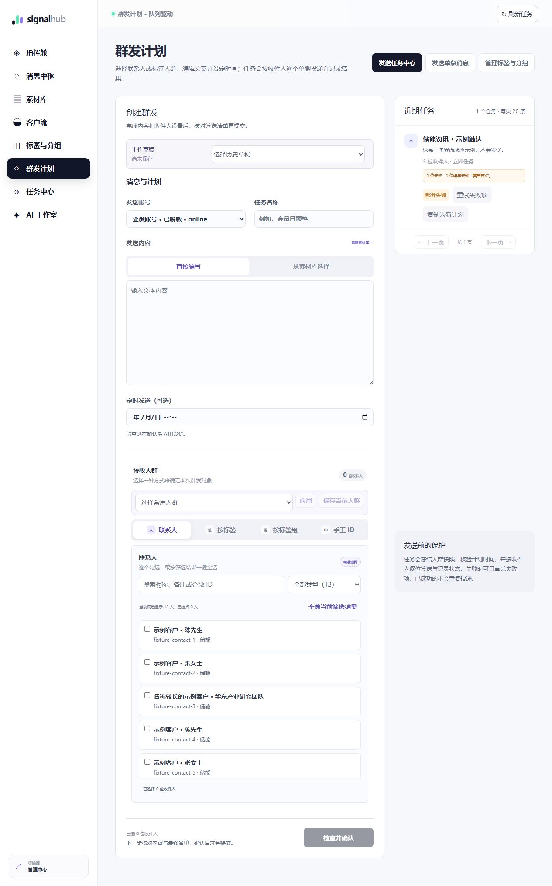

### 07 · 任务中心：查看结果，处理异常

逐收件人查看发送结果，核对异常状态，并单独重试失败项。

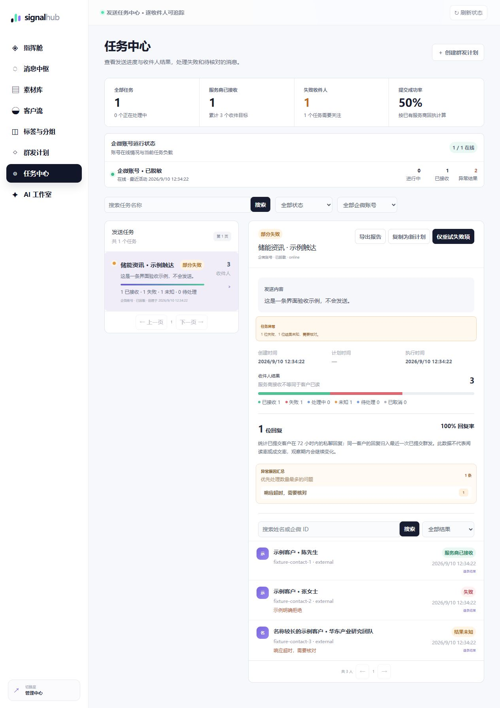

### 08 · AI 工作室：辅助整理咨询与跟进建议

通过自然语言辅助分析客户信息、整理咨询要点和准备跟进建议；发送操作需人工确认。

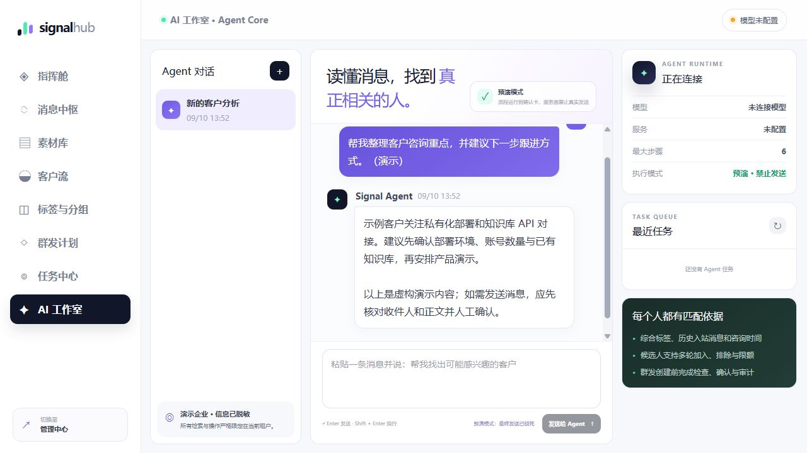

### 09 · 管理中心：本公司数据统一管理

集中查看租户成员、企微账号、网络配置与风险提示。

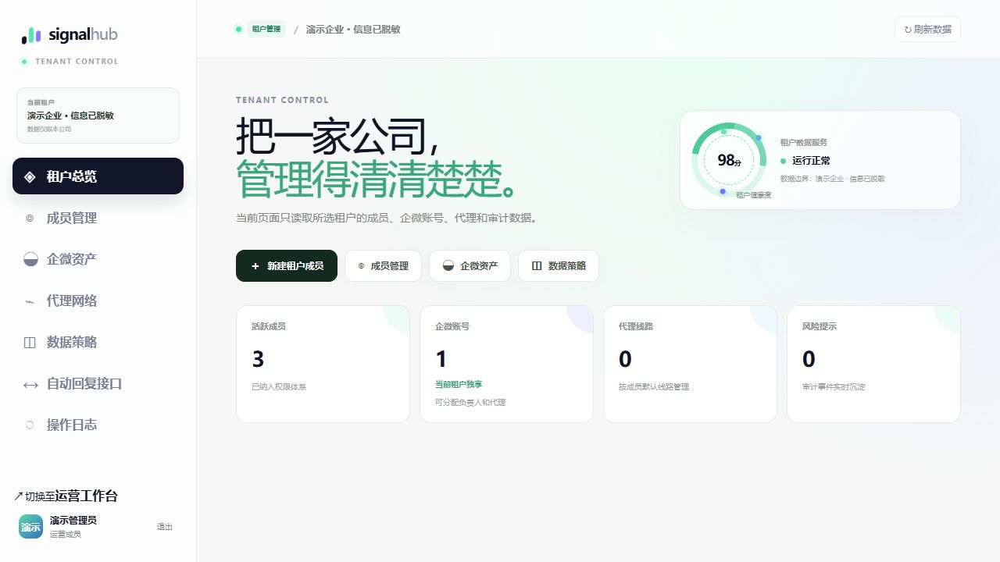

### 10 · 成员管理：成员、角色与账号配额

查看登录成员、分配角色、管理状态和在线企微账号配额。

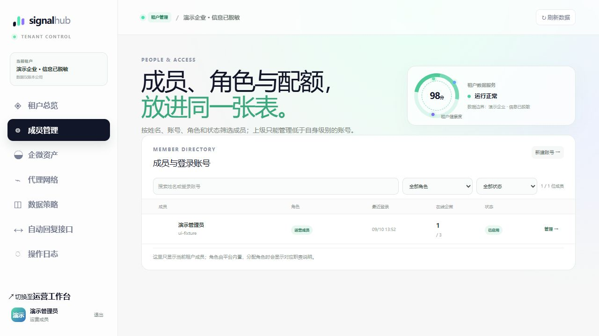

### 11 · 企微资产：账号负责人和网络归属

统一查看账号状态、负责人及网络线路分配。

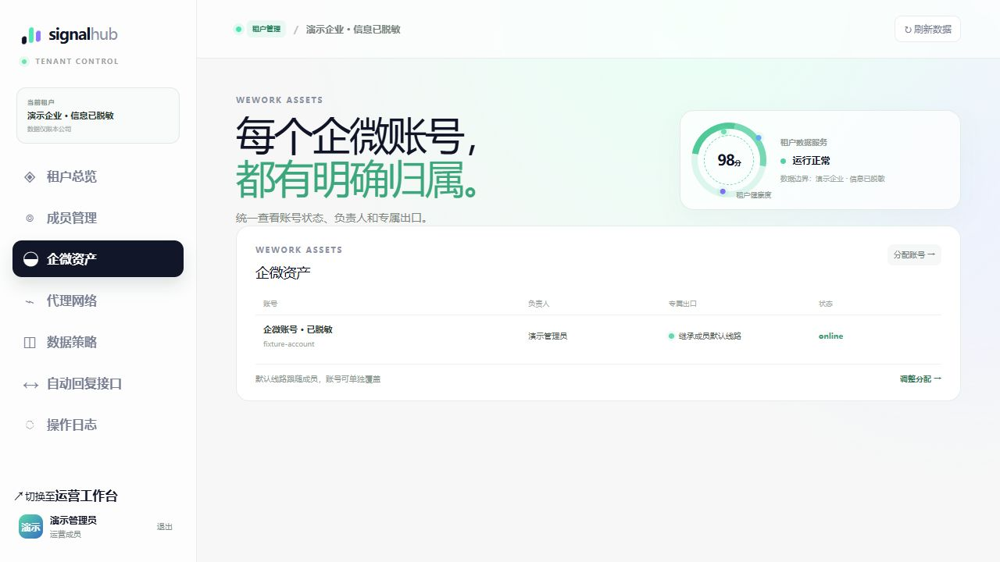

### 12 · 代理网络：按需管理专属出口

为有独立出口需求的成员配置线路，管理账号的网络归属。

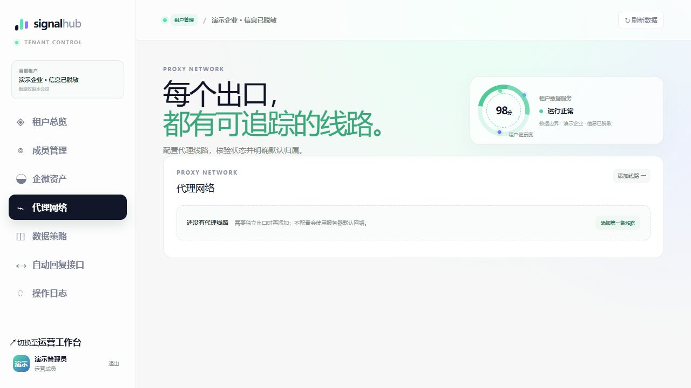

### 13 · 数据策略：明确撤回消息的处理方式

配置撤回消息的内容隐藏与审计保留策略，具体适用范围在页面中说明。

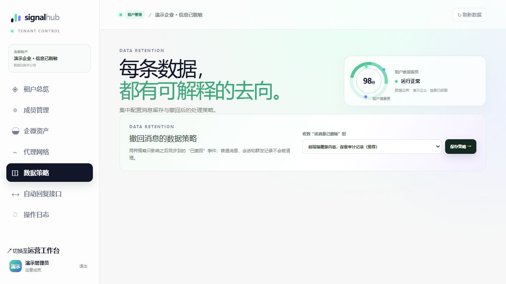

### 14 · 自动回复：知识库接口、试运行与人工接管

租户独立设置接口，选择企微账号和运行模式；下方查看候选答案与人工接管入口。统一协议支持回复、忽略和建议人工接管。

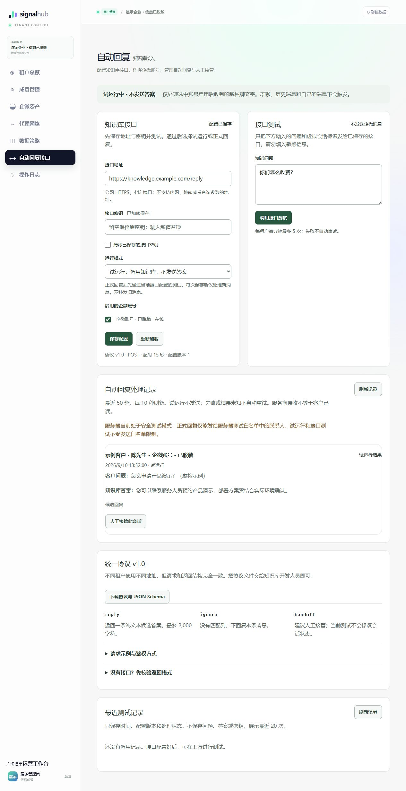

### 15 · 操作日志：关键变更可以追溯

按类型、结果和关键词查看本公司操作记录，核对操作人与时间。

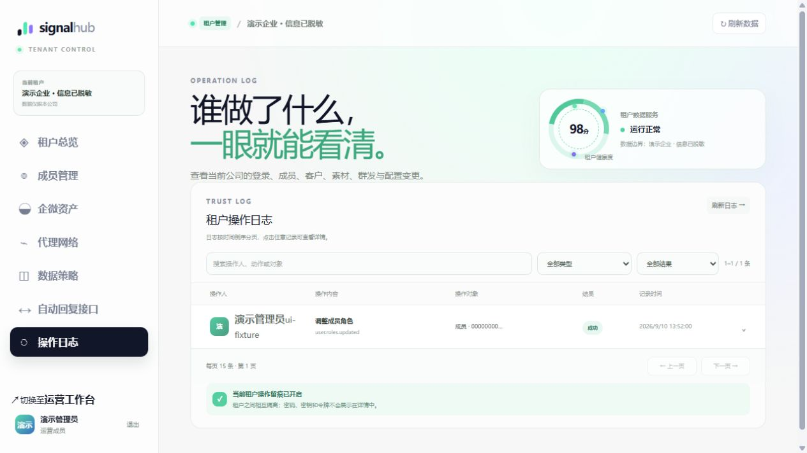

## 工作流程

客户管理、内容准备与发送记录按以下流程关联：

**连接账号 → 同步消息与客户 → 标签分组 → 准备素材 → 创建触达任务 → 查看结果与跟进。**

AI 可辅助查找客户和准备发送任务；租户也可以接入自己的知识库接口，让新私聊文字按统一协议获得自动回复。

### 适合的场景

- **客户运营团队**：统一查询对话，维护标签和跟进状态，减少重复整理。
- **销售与客户成功团队**：按客户特征筛选人群，安排后续联系，复用内容。
- **多公司运营团队**：在同一平台管理不同租户的成员、账号及运营数据。
- **已有知识库或业务系统的企业**：保留原有知识库，通过接口接入消息回复流程。

## 功能介绍

| 模块 | 可以做什么 |
| --- | --- |
| 指挥舱 | 查看账号、消息、客户和触达任务概况，快速进入常用运营操作 |
| 消息中枢 | 按账号查看联系人与会话，查询历史消息，进行消息收藏、转发和沟通 |
| 素材库 | 将文字、链接、图片与文件整理为可复用素材包，支持个人素材与租户共享，多条内容按顺序使用 |
| 客户与跟进 | 搜索、筛选已同步客户，维护跟进状态、下次跟进时间、记录与负责标识，查看到期跟进对象 |
| 标签与分组 | 维护标签、组合标签组，将客户特征用于人群筛选和运营分组 |
| 群发计划 | 选择账号、内容与收件人，使用草稿及常用人群，发送前检查，创建即时或定时任务 |
| 任务中心 | 查看队列进度及逐条处理结果，暂停或恢复任务、处理可重试失败项、人工核对未知结果、导出报告 |
| AI 工作室 | 用自然语言查询信息，结合标签和历史咨询辅助匹配客户，多轮调整候选人群，确认后执行支持的发送操作 |
| 自动回复 | 租户独立配置知识库接口，选择企微账号，试运行或正式处理新私聊文字，支持忽略与人工接管 |
| 管理中心 | 管理平台与业务租户、成员、角色、企微账号配额、连接配置及操作审计 |

### 发送记录与保护机制

- 发送任务保留收件人快照与逐条处理记录，便于排查问题。
- 服务商已接收、失败、待处理及未知结果分别展示，避免把不确定状态当成功。
- 任务详情可观察提交后一定时间窗口内的私聊回复人数与回复率。
- 客户可设置免打扰或暂停触达，发送前进行校验。
- 相同账号向同一对象提交相同内容时，采用可配置时间窗口的重复发送保护。

**服务商接收不等于客户已读。回复率不等于成交率，也不能证明一次触达带来了转化。**

## 租户自带知识库的自动回复

每个租户可以保留现有知识库，配置独立的 HTTPS 接口与密钥，并遵循相同的请求和响应协议。

平台负责收消息、确定租户和原会话、调用接口及发送控制；知识库负责理解问题并返回答案或处理决定。知识库不能通过响应更换接收人。

| 模式 / 决策 | 行为 |
| --- | --- |
| 关闭 | 不自动处理客户消息 |
| 接口测试 | 使用管理员输入的问题及虚拟会话标识测试，不发送企微消息 |
| 试运行 | 调用知识库并记录新消息的候选答案，不自动发送 |
| 正式回复 | 按返回决策处理，并遵守平台发送策略 |
| `reply` | 返回一条纯文本答案 |
| `ignore` | 本条不回复 |
| `handoff` | 正式模式下暂停该会话，等待人工恢复 |

### 当前基础版边界

自动回复流程已实现，真实知识库与账号收发需联调验证。当前仅处理已启用在线账号收到的新私聊文字；不自动处理群聊、图片、语音或历史消息。连续消息目前只处理最新一条，不自动合并，也不向知识库附带历史聊天。

当前采用有限批量、串行处理与时效限制，适合先做小范围验证。高消息量下可能出现等待、过期或跳过，不承诺高并发吞吐。失败不自动重试，发送结果未知需人工核对。完整规则及示例见 [自动回复接入说明](docs/auto-reply.md)。

## API 与系统对接

Signal Hub 已有覆盖账号、联系人、标签、消息、素材、任务和管理操作的后端接口，可作为私有化集成基础。实际接入需按部署版本、授权及租户边界联调。

- **业务集成**：查询客户与标签，关联素材，创建及查询触达任务，读取处理结果。
- **消息接入**：通过当前企微接入服务的回调与同步机制接收数据；能否使用某项能力取决于接入服务、账号状态及权限。
- **知识库对接**：统一 JSON 协议、Bearer 密钥鉴权，支持租户独立地址。
- **AI 能力**：根据部署配置连接模型服务，辅助查询和人群匹配。

注意：现有业务 API 使用登录会话与角色授权，**不是已提供通用 API Key / OAuth 开放平台**；也不宣称已提供面向任意业务系统的通用事件订阅。外部系统鉴权、字段映射和专用回调需求需另行评估。

详见 [系统集成说明](docs/integration.md)。

## 私有化部署与合作咨询

部署环境、交付范围与 API 集成需求可通过以下方式沟通：

- **GitHub 维护方**：[Vunify-bingo](https://github.com/Vunify-bingo)
- **产品问题与需求**：可通过 [Issues](https://github.com/Vunify-bingo/Signal-Hub-Public/issues) 描述非敏感需求，或使用下方联系方式咨询。
- **电话 / 企微联系手机号**：**13472721242**
- **添加企微咨询**：扫描下方二维码，咨询产品演示、私有化部署和 API 对接。

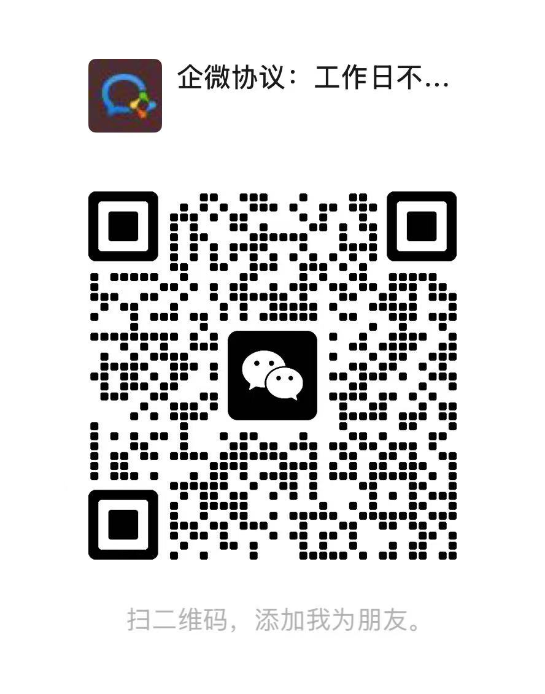

沟通时建议说明：公司使用场景、预计企微账号数量、日常咨询量、部署环境，以及是否已有知识库/API。

不要在公开 Issues 中提交客户聊天、手机号、接口密钥、服务器账号或未脱敏截图。

私有化部署可以讨论应用与业务数据的自有环境部署。企微通道、模型或外部知识库仍可能涉及外部调用；**私有化不自动等于离线运行或数据完全不出网**。具体依赖、交付范围、费用与维护方式以双方确认的方案为准。详见 [部署与咨询](docs/deployment.md)。

## 常见问题

**这是开源项目吗？** 不是。本仓库仅展示产品与对接说明，不包含软件源码或开源授权。

**能下载仓库直接运行吗？** 不能。部署包、环境准备与授权需要单独沟通。

**必须使用平台自己的知识库吗？** 不需要。可以接入租户自有知识库，但需符合统一接口协议。

**AI 会直接给客户群发吗？** AI 辅助发送操作需要人工确认，并受服务端发送策略约束；自动回复是独立、默认关闭的功能。

**能保证消息送达或账号永远不受限制吗？** 不能。账号能力及服务可用性受接入服务、网络与平台规则影响。

**能看实际界面吗？** 本页已提供演示数据截图，也可通过电话或企微联系安排产品演示；不会公开未脱敏的业务截图。

---

具体功能与接入范围以交付版本为准。
